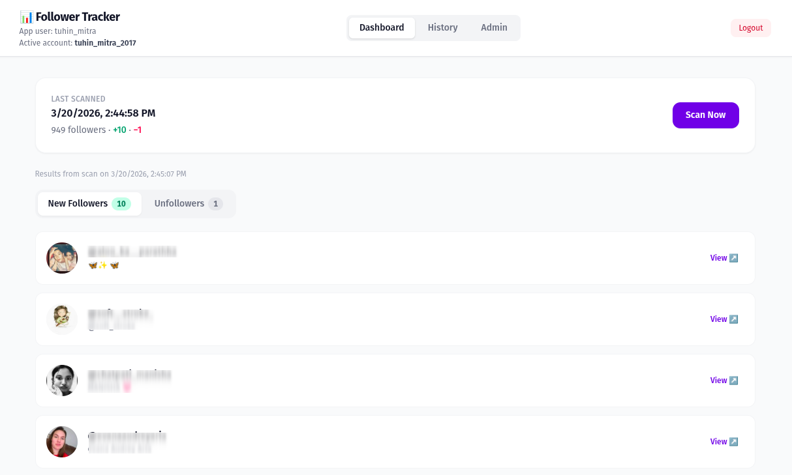

# Meerkit

A modern web application for tracking Instagram follower changes. Monitor new followers, unfollowers, and access cached profile pictures with a responsive Vue 3 frontend backed by a Flask REST API.

[](https://www.python.org/)
[](https://flask.palletsprojects.com/)
[](https://vuejs.org/)
[](LICENSE)

## Features

- 🔍 **Real-time follower scanning** – Fetch current Instagram follower list using Instagram session credentials stored per account
- 📊 **Diff tracking** – Automatically compute new followers and unfollowers between scans
- 🖼️ **Image caching** – Cache profile pictures locally and serve through the API
- 💾 **Persistent storage** – SQLite database with scan history and metadata
- ⚡ **Responsive UI** – Vue 3 + TailwindCSS dashboard with real-time scan status
- 🔐 **Multi-user support** – Separate app user accounts with per-account Instagram credentials
- 📱 **RESTful API** – Well-documented endpoints for all operations

## Quick Start

### Prerequisites

- Python ≥ 3.12
- Node.js ≥ 20
- Instagram account (for session credentials)

### Installation

```bash
# Clone and navigate to repo
git clone <repo-url>
cd meerkit

# Create Python virtual environment
python3 -m venv .venv
source .venv/bin/activate

# Install Python dependencies
pip install -e .

# Install frontend dependencies
cd frontend
npm install
cd ..
```

### Configuration

No `.env` file is required.

If you want to override Flask's default development secret, export `APP_SECRET_KEY` in the shell before starting the backend:

```bash
export APP_SECRET_KEY=your_app_secret_key_here
```

Instagram credentials are managed inside the application. After you register and log in, add an Instagram account through the UI or the `/api/auth/instagram-users` endpoint.

### Running the App

**Terminal 1: Start the backend**

```bash
source .venv/bin/activate
flask --app backend.app run --debug --port 5000
```

**Terminal 2: Start the frontend**

```bash
cd frontend
npm run dev
```

Then open [http://localhost:5173](http://localhost:5173) in your browser.

## Dashboard Preview



The dashboard displays real-time follower scan results, showing new followers, unfollowers, and scan history at a glance.

## Documentation

Full documentation is available in the [docs/](docs/) directory and on GitHub: [Tuhin-thinks/meerkit](https://github.com/Tuhin-thinks/meerkit).

- [Architecture Overview](docs/architecture.md) – System design and data flow
- [Backend API](docs/backend.md) – Flask routes and service layer
- [Frontend Guide](docs/frontend.md) – Vue 3 components and state management
- [Database Schema](docs/database.md) – SQLite schema and design
- [Setup & Installation](docs/setup.md) – Detailed environment setup
- [Development Workflow](docs/development.md) – Local development guide
- [API Reference](docs/api-reference.md) – Complete endpoint documentation

Build and serve docs locally:

```bash
pip install mkdocs mkdocs-material
mkdocs serve
```

Then navigate to [http://localhost:8000](http://localhost:8000).

## Project Structure

```
meerkit/
├── backend/                  # Flask application
│   ├── app.py               # Application factory
│   ├── config.py            # Configuration
│   ├── routes/              # API blueprints
│   ├── services/            # Business logic
│   ├── db/                  # Database handlers
│   └── workers/             # Background tasks
├── frontend/                # Vue 3 + Vite
│   ├── src/
│   │   ├── components/      # Vue components
│   │   ├── views/           # Page layouts
│   │   ├── services/        # API client
│   │   └── types/           # TypeScript types
│   └── vite.config.ts
├── data/                    # Scan results, diffs, cache
├── docs/                    # MkDocs documentation
└── pyproject.toml
```

## API Endpoints

| Method | Path                 | Description                          |
| ------ | -------------------- | ------------------------------------ |
| `POST` | `/api/scan`          | Start a new follower scan            |
| `GET`  | `/api/scan/status`   | Get scan status (idle/running/error) |
| `GET`  | `/api/summary`       | Get latest scan summary with counts  |
| `GET`  | `/api/diff/latest`   | Get latest diff (new + unfollowers)  |
| `GET`  | `/api/diff/<id>`     | Get specific diff by ID              |
| `GET`  | `/api/history`       | Get full scan history                |
| `GET`  | `/api/image/<pk_id>` | Get cached profile picture           |
| `POST` | `/api/auth/register` | Register new app user                |
| `POST` | `/api/auth/login`    | Log in app user                      |
| `POST` | `/api/auth/logout`   | Log out current app user             |
| `GET`  | `/api/auth/me`       | Get current user context             |
| `GET`  | `/api/auth/instagram-users` | List Instagram accounts for current user |
| `POST` | `/api/auth/instagram-users` | Add a new Instagram account    |
| `GET`  | `/api/auth/instagram-users/<instagram_user_id>` | Get Instagram account details |
| `PATCH` | `/api/auth/instagram-users/<instagram_user_id>` | Update Instagram account credentials |
| `POST` | `/api/auth/instagram-users/<instagram_user_id>/select` | Set active Instagram account |
| `DELETE` | `/api/auth/instagram-users/<instagram_user_id>` | Remove an Instagram account |
| `DELETE` | `/api/auth/instagram-users` | Remove all Instagram accounts |

See [API Reference](docs/api-reference.md) for detailed documentation.

## Development

### Running Tests

```bash
# Backend: Run all tests
python -m pytest

# Frontend: Run all tests
cd frontend && npm run test
```

### Code Style

```bash
# Format Python code
black backend/

# Check Python types
mypy backend/

# Lint Python
ruff check backend/

# Format frontend
cd frontend && npm run lint
```

### Building for Production

```bash
# Backend: No build needed, run Flask with FLASK_ENV=production
FLASK_ENV=production flask --app backend.app run --port 5000

# Frontend: Create optimized bundle
cd frontend && npm run build
# Output: frontend/dist/
```

## Architecture Highlights

- **Database**: SQLite with scan history, scanned follower data, diff records, and image cache
- **Backend**: Flask with thread-local DB handlers for concurrent scan workers
- **Frontend**: Vue 3 + TanStack Query for data fetching, TailwindCSS for styling
- **Image Caching**: Disk-backed cache with optional in-memory layer for hot images
- **Multi-Account**: Support for multiple Instagram accounts per app user with session isolation

## Contributing

1. Create a feature branch: `git checkout -b feature/your-feature`
2. Follow the code style guidelines (black, ruff, mypy)
3. Write tests and ensure all tests pass
4. Submit a pull request

## Troubleshooting

### "ECONNREFUSED" errors on frontend startup

This occurs when Vite tries to proxy `/api/` requests but the Flask backend isn't running yet.

**Solution:** Start the Flask backend first, then open the frontend.

### "Cannot read properties of undefined (reading 'toLocaleString')"

This was a bug where the summary API response was missing `follower_count`. It has been fixed in v0.1.0.

**Solution:** Ensure you're on the latest version.

## License

MIT License – see LICENSE file for details

## Support

For issues and questions:

- Open a [GitHub Issue](https://github.com/Tuhin-thinks/meerkit/issues)
- Check [Troubleshooting](docs/development.md#troubleshooting) section in docs
- Review [API Reference](docs/api-reference.md) for endpoint details
